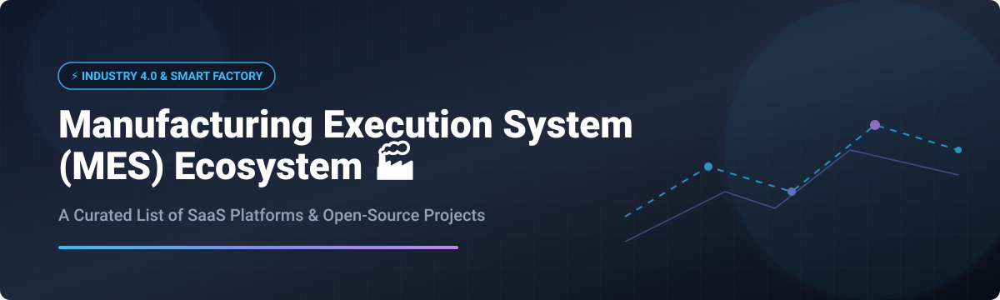

  

# Awesome Manufacturing Execution System (MES) 🏭 ⚙️

  
  
  
  
  

## 🌟 Top Manufacturing Execution System (MES) Ecosystem & Industry 4.0 Solutions 🚀

**Curated List of SaaS Products & Open-Source GitHub Projects**  
*Focused on Shop-Floor Execution, Production Tracking, Traceability, OEE, Quality, Work-Order Management & Real-Time Manufacturing Visibility*  

**Last updated: September 2026** 📅

---

### 📌 Overview & Industry Scope 💡
This repository tracks notable **SaaS / commercial platforms** and **open-source projects** for **Manufacturing Execution Systems (MES)**. These systems bridge ERP and the shop floor—managing work orders, tracking production in real time, enforcing process steps, capturing genealogy/traceability, monitoring OEE, and supporting quality and compliance in modern Industry 4.0 smart factories.

---

## 📑 Table of Contents
- [📊 Market Overview & Industry Structure](#-market-overview--industry-structure)
- [☁️ SaaS & Hosted Platforms](#️-saas--hosted-platforms)
- [💻 Open-Source GitHub Projects](#-open-source-github-projects)
- [🤝 How to Contribute](#-how-to-contribute)
- [☕ Support & Sponsorship](#-support--sponsorship)
- [⚠️ Disclaimer](#️-disclaimer)
- [📈 Star History](#-star-history)

---

## 📊 Market Overview & Industry Structure 📈

> **Estimated Market Size & Dynamics**: The global Manufacturing Execution System (MES) market is estimated at **~$15.8 Billion in 2026** (projected to reach **~$24.5 Billion by 2030** at a CAGR of ~11.5%). The market is **moderately fragmented**, featuring established industrial conglomerates (Siemens, Rockwell Automation, AVEVA, GE) dominating heavy enterprise & multi-plant operations, alongside rapidly growing cloud-native, no-code SaaS challengers (Tulip, Critical Manufacturing) and open-source solutions capturing mid-market and SMB production floors.

---

## ☁️ SaaS & Hosted Platforms 🏬

The SaaS and commercial MES market ranges from enterprise suites to agile no-code apps. Products below are sorted by company size/valuation (descending):

| Platform 🏭 | Key Features & Focus 🎯 | Company Scale (Revenue / Valuation) 💰 | Starting Pricing 💵 | Free Tier / Trial Limit ⏱️ |
| :--- | :--- | :--- | :--- | :--- |
| **[Siemens Opcenter](https://www.sw.siemens.com/)** | Comprehensive MOM suite covering execution, quality, scheduling, and digital twin integration. | **~$80 Billion** (Siemens AG annual revenue) | Standard enterprise deployment starts ~$15,000 / year | No free tier; custom demo request |
| **[GE Digital / Proficy Plant Applications](https://www.ge.com/digital/)** | Established MES platform for production execution, genealogy, and multi-plant performance. | **~$68 Billion** (GE Digital / GE Aerospace annual revenue) | Enterprise licensing starts ~$12,000 / year | No free tier; contact sales for trial |
| **[Rockwell FactoryTalk MES](https://www.rockwellautomation.com/)** | Tightly integrated with Rockwell automation hardware for discrete & process manufacturing. | **~$9.0 Billion** (Rockwell Automation annual revenue) | Base module pricing starts ~$10,000 / year | No free tier; demo upon request |
| **[AVEVA MES / DELMIA Apriso](https://www.aveva.com/)** | Enterprise MES supporting complex genealogy, paperless quality, and compliance workflows. | **~$1.6 Billion** (AVEVA annual revenue) | Enterprise packages start ~$10,000 / year | No free tier; request proof-of-concept |
| **[Tulip](https://tulip.co/)** | No-code frontline operations platform for building custom shop-floor apps & work instructions. | **~$1.0 Billion** (Valuation / Series C Unicorn) | **$1,200 / station / year** (Standard Tier) | **30-day free trial** (Full feature access) |
| **[Critical Manufacturing](https://www.criticalmanufacturing.com/)** | Cloud-native MES for high-tech, electronics, medical devices, and complex discrete plants. | **~$100 Million+** (Subsidiary of ASMPT group) | Commercial tier starts ~$8,000 / year | No free tier; scheduled demo |
| **[Sepasoft MES (Ignition)](https://inductiveautomation.com/)** | Flexible MES modules built on Inductive Automation's Ignition SCADA platform. | **~$50 Million+** (Inductive Automation ecosystem) | **$2,150 / module** (One-time license) | **Unlimited free trial** (2-hour auto-reset runtime) |

---

## 💻 Open-Source GitHub Projects 🛠️

Open-source MES platforms provide self-hosted control, zero license fees, and deep customization for small-to-mid-size manufacturers. Sorted by GitHub Star Count (descending):

| Repository 📦 | Description & Capabilities 📝 | License 📜 | Star Count ⭐ |
| :--- | :--- | :--- | :--- |
| **[InvenTree](https://github.com/inventree/InvenTree)** | Open-source inventory, work-order management, and production tracking system with build management and part genealogy. | MIT |  |
| **[Carbon](https://github.com/crbnos/carbon)** | Open-core ERP + MES + QMS platform for complex assembly, contract manufacturing, lot/serial genealogy, and shop-floor execution. | AGPL-3.0 |  |
| **[industry4.0-mes](https://github.com/ricefishtech/industry4.0-mes)** | Open-source Java/Spring-based manufacturing execution system covering work order management, quality, and shop-floor tracking. | AGPL-3.0 |  |
| **[smart-industry](https://github.com/jukbot/smart-industry)** | Open-source MES optimized for JobShop type manufacturers, supporting scheduling, material tracking, and process flow. | GPL-3.0 |  |
| **[free-mes](https://github.com/metaxk-company/free-mes)** | Lightweight cloud-ready free MES providing core shop-floor management, scheduling, and device connectivity. | Apache-2.0 |  |
| **[WebErpMesv2](https://github.com/SMEWebify/WebErpMesv2)** | Web-based ERP & MES tailored for sheet metal, machining, and mold industrial manufacturing operations. | GPL-3.0 |  |
| **[osess/mes](https://github.com/osess/mes)** | Django-powered Manufacturing Execution System bridging high-level production schedules and low-level shop floor control. | MIT |  |
| **[OpenMES](https://github.com/Mes-Open/OpenMes)** | Modern self-hosted, tablet-first MES aimed at small & mid-sized manufacturers for production tracking, quality, and work orders. | AGPL-3.0 |  |
| **[cloud-mes](https://github.com/cloud-mes/cloud-mes)** | Rails 5 based cloud Manufacturing Execution System for real-time order tracking and capacity allocation. | MIT |  |
| **[mes4u](https://github.com/sindohmes/mes4u)** | Web-based open-source MES by Sindoh built with Spring Boot & Vue.js, derived from real factory operations. | LGPL-2.1 |  |
| **[CaSkade-MES](https://github.com/CaSkade-Automation/CaSkade-MES)** | Semantic skill-based MES leveraging knowledge graphs and BPMN (Camunda) to execute complex flexible production workflows. | MIT |  |
| **[iPlusMES](https://github.com/iplus-framework/iPlusMES)** | Configurable .NET-based MES framework connecting enterprise ERP planning to shop-floor equipment and maintenance. | LGPL-3.0 |  |

---

## 🤝 How to Contribute ✏️

Contributions are very welcome! To add or update a project:
1. Fork this repository 🍴.
2. Add/edit entries in `README.md` following the tabular layout.
3. Ensure factual information for starting prices, trial limits, licenses, and official links.
4. Submit a Pull Request (PR) 🚀 with a brief summary of additions.

---

## ☕ Support & Sponsorship 💖

If you find this curated MES ecosystem guide useful for your digital transformation journey, production floor planning, or software research, please consider supporting the project!

- **⭐ Star** this repository to increase visibility.
- **🔄 Fork** and share with fellow manufacturing engineers & developers.
- **💖 Sponsor**: You can support ongoing open-source curation and maintenance via the [GitHub Sponsor Dashboard](https://github.com/sponsors/ishandutta2007).

---

## ⚠️ Disclaimer 🔒

- This list is **community-curated** for informational and educational purposes only.
- MES platforms sit at the core of mission-critical production operations and often support heavily regulated sectors (automotive, aerospace, medical devices, food & beverage).
- Evaluate regulatory compliance, hardware integration effort (OPC-UA / MQTT / PLCs), and total cost of ownership (TCO) carefully prior to deployment.

---

## 📈 Star History 📊

---

  <i>Maintained by <a href="https://github.com/ishandutta2007">ishandutta2007</a> for manufacturing engineers, digital transformation leads, &amp; shop-floor technologists worldwide.</i> 🌐

